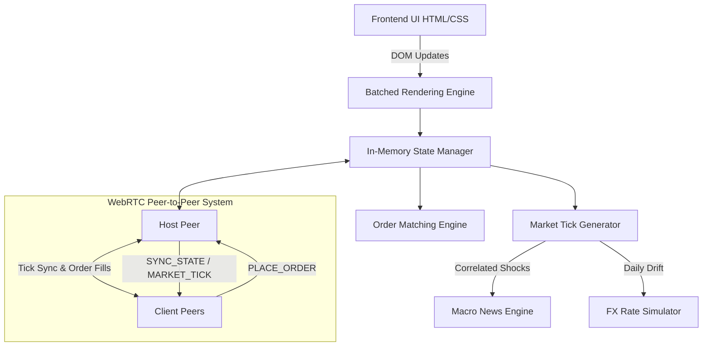

<div align="center">
  <h1>📈 Trading Terminal Simulator (Dalal Street)</h1>
  <p><b><i>An ultra-realistic, high-performance, real-time trading terminal simulator built entirely with client-side web technologies and WebRTC Peer-to-Peer multiplayer.</i></b></p>
  
  <div>
    
    
    
    
    
    
    
    
  </div>
</div>

<hr>

<details>
<summary><b>📑 Table of Contents</b> (Click to expand)</summary>

- [🌟 The Ultimate Sandbox](#-the-ultimate-sandbox)
- [🛠 Core Architecture & Tech Stack](#-core-architecture--tech-stack)
- [🌐 Real-Time Peer-to-Peer Multiplayer](#-real-time-peer-to-peer-multiplayer)
- [📁 Project Structure](#-project-structure)
- [🧮 Simulation Engine & Math Models](#-simulation-engine--math-models)
- [🔥 Every Nudge & Feature](#-every-nudge--feature)
- [🎮 How to Play](#-how-to-play)
- [💻 Quick Start](#-quick-start)
- [🚀 Deploying to Vercel](#-deploying-to-vercel)
- [🧪 Running Tests](#-running-tests)
- [🛡 Security Note](#-security-note)
- [🤝 Contributing](#-contributing)
- [📄 License](#-license)
</details>

---

## 🌟 The Ultimate Sandbox
Welcome to **Trading Terminal Simulator**—a highly accurate, tick-by-tick financial market microstructure simulator. Engineered for quantitative analysis, strategy backtesting, algorithmic bot development, peer-to-peer multiplayer trading, and educational purposes. It allows users to interact with synthetic markets featuring authentic liquidity constraints, timezone synchronization, dynamic macroeconomic news, Black-Scholes derivatives pricing, interactive Option Chains, technical indicators (VWAP, RSI, MACD, Bollinger Bands), and a living economy with **daily-drifting foreign exchange rates**.

---

## 🛠 Core Architecture & Tech Stack

This application is built from the ground up with a strict focus on **zero-latency execution** and **high-frequency DOM updates**. To achieve this, it relies entirely on native browser APIs without the overhead of heavy frameworks.

### Technology Stack
*   **Core UI / Frontend**: Vanilla HTML5, CSS3, JavaScript (ES6+). Modern glassmorphism UI with high-contrast emerald & crimson action controls.
*   **Multiplayer Engine**: PeerJS & WebRTC for real-time host-client state broadcasting, order routing, and peer synchronization.
*   **State Management**: 100% in-memory client-side architecture for blazing fast order matching.
*   **Rendering & Charting**: Custom batched DOM updates and Canvas/SVG charting supporting Candlesticks, Technical Indicators (RSI, MACD, VWAP, SMA/EMA), and interactive drawing tools.
*   **Math Utilities**: Pure, side-effect-free math functions extracted into `js/math-utils.js` — shared by the simulation engine and the test suite.
*   **Code Quality / Linting**: **ESLint** configured (`eslint.config.mjs`) to ensure strict ECMAScript rules across the codebase.



---

## 🌐 Real-Time Peer-to-Peer Multiplayer

The simulator features a serverless **WebRTC Peer-to-Peer Multiplayer System** built using PeerJS:

*   **Host & Room Generation**: Create rooms instantly with random room codes (e.g. `DALAL-A1B2`) featuring automatic collision detection and ID retries.
*   **Peer Synchronization**: Host broadcasts tick data, LTP, open/base prices, bids/asks, order book depth, liquidity, and news events to connected clients in real time.
*   **Client Clock Suspension**: Client simulation intervals automatically pause (`window._stopClientClockFn`) while connected to follow the host's market clock, resuming cleanly upon disconnect (`window._restartClockFn`).
*   **Host Order Matching**: Clients dispatch order requests (`PLACE_ORDER`) over WebRTC. The host validates margin, circuit halts, and liquidity, responding with `ORDER_FILLED`, `ORDER_REJECTED`, or `PARTIAL_FILL` messages.
*   **Auto-Retry Partial Fills**: Partial fills unlock margin proportionally and assign a pre-generated retry ID to cleanly handle unfilled quantity retries without double-execution race conditions.
*   **Connection Health**: The session panel reports measured ping, jitter, route (`Direct P2P` or `TURN relay` where browser stats are available), last host tick, synchronization state, session duration, and host-side connected-client status.
*   **Resilient WebRTC Lifecycle**: Features 12-second join timeout guards, atomic news draining, duplicate tick push guards, XSS-safe DOM node creation, immediate peer-close cleanup, and a 15-second heartbeat timeout for peers that disappear without sending a close event.

### Multiplayer Network Notes

The host is the browser that creates the room; it must remain open for the session to continue. Multiplayer connections use WebRTC. Most networks connect directly, but restrictive networks, VPNs, and some carrier-grade NAT configurations may require a TURN relay. A GitHub Pages deployment hosts the static app only and does not itself provide a TURN server.

The **Connection Health** panel is role-aware:

* **Clients** see the measured round-trip ping to the host, jitter derived from recent pings, time since the last received host tick, sync status, route detection, and session duration.
* **Hosts** see active client count, host-to-client ping and jitter, broadcast activity, route detection for an active peer, and session duration. Disconnected or unresponsive peers are removed from the peer list automatically.

---

## 📁 Project Structure

The codebase is highly modular, separating core engine logic from UI events, technical indicators, multiplayer networking, and feature modules:

```text
tradingterminal/
├── index.html              # The main single-page application view
├── studio.html             # The standalone Algorithmic Bot IDE window
├── server.js               # Node.js static server for local development
├── start.bat               # One-click Windows launch script
├── vercel.json             # Vercel deployment config (headers, rewrites, CSP)
├── README.md               # Documentation
├── eslint.config.mjs       # Strict linting rules for the codebase
├── package.json            # Node/NPM dependencies & dev scripts
├── css/
│   └── styles.css          # Core design system, glassmorphism, responsive layout
├── components/             # Reusable UI view templates (view-terminal, view-multiplayer, etc.)
├── tests/
│   └── indicators.test.js  # Unit tests — imports directly from js/math-utils.js
└── js/
    ├── app.js              # Core initialization, rendering loop, and state management engine
    ├── bot.js              # Algorithmic Bot execution sandbox & API interfaces
    ├── charts.js           # Canvas/SVG charting (Candlesticks, RSI, MACD, VWAP, Bollinger Bands)
    ├── customization.js    # Themes (Dark, Cyberpunk, Light, Sepia), font selectors, UI preferences
    ├── data.js             # Asset definitions, sector base volumes, fundamental constants
    ├── investments.js      # Mutual Funds, Daily SIP automation, IPO lotteries, Real Estate
    ├── main.js             # Component mounting & entry point bootstrapping
    ├── math-utils.js       # Pure math utilities (SMA, stdNormCDF/PDF, escapeHTML, fmtPrice)
    ├── multiplayer.js      # WebRTC PeerJS multiplayer engine, host/client state sync
    ├── news.js             # Macroeconomic news engine & asset correlation matrix
    ├── options.js          # Black-Scholes pricing model, Option Chains, multi-leg strategies
    ├── storage.js          # localStorage adapter for simulation persistence
    ├── studio.js           # CodeMirror IDE logic for the algorithmic studio
    ├── syndicate.js        # Black Market crate system & insider perk logic
    └── ui_events.js        # Global DOM event listeners & user interactions
```

---

## 🧮 Simulation Engine & Math Models

We don't just generate random numbers. The engine simulates a professional trading environment:

*   **Stochastic Calculus (GBM)**: Tick generation mimics Geometric Brownian Motion, factoring in asset-specific volatility and drift.
*   **Live FX Simulation**: Exchange rates (USD, CNY, JPY, GBP, EUR, HKD, AUD, CAD, CHF) drift ±0.3% per simulated day using the seeded PCG RNG, capped at ±15% of their baseline values — making cross-currency trades feel dynamic over time.
*   **Order Book & Liquidity**: Level 2 Order Books scale dynamically based on Base Volume. Large market orders *will* suffer from slippage.
*   **Options Pricing & Greeks**: Dynamic premium decay (Theta) and elasticity (Delta, Gamma, Vega, Rho) calculated using Black-Scholes formulas.
*   **Technical Analysis Plugins**: Real-time recalculation of VWAP, RSI (14), MACD (12, 26, 9), SMA, EMA, and Bollinger Bands.
*   **Macro Correlation**: Global assets are linked via a Correlation Matrix. A single news event can trigger sector-wide rallies or market crashes.

---

## 🔥 Every Nudge & Feature

### 📊 1. Market Microstructure & Charting
*   **Realistic Liquidity**: Orders consume bid/ask order book depth with dynamic slippage.
*   **Global Exchanges**: NYSE, NASDAQ, NSE, TSE, HKEX, LSE with timezone synchronization.
*   **Circuit Breakers**: Extreme volatility triggers upper/lower circuit halts, locking trading until reset.
*   **Technical Charting**: Candlestick toggle, volume bars, technical indicators (VWAP, RSI, MACD, SMA/EMA, Bollinger Bands), and canvas drawing tools.

### âš¡ 2. Order Execution & High-Contrast UI
*   **Order Types**: Market, Limit, Stop, and Stop-Limit orders.
*   **Time-in-Force (TIF)**: DAY, Immediate or Cancel (IOC), Fill or Kill (FOK).
*   **Modern Action Controls**: Redesigned glowing emerald **BUY** and rose crimson **SELL / SHORT** buttons with high visibility and subtle micro-animations.
*   **Margin & Risk**: Strict position caps, margin locks, trailing stop-losses (TSL), target auto-squareoff, short selling escrows, and live P&L tracking.

### 🌐 3. Real-Time WebRTC Multiplayer
*   **Host or Join Markets**: Share 4-digit room codes to host multi-trader sessions.
*   **Shared Market Clock**: Client clocks pause automatically and sync to the host's tick speed.
*   **Remote Order Execution**: Client orders route to the host's matching engine with instant fill confirmation, partial fill auto-retry, or rejection feedback.

### 📉 4. Derivatives & Option Chains
*   **Calls & Puts**: Trade synthetic option contracts across strike prices.
*   **Interactive Option Chain**: Visual option chain modal showing live strike prices, bids, asks, and volume.
*   **Multi-Leg Strategies**: Execute Straddles, Strangles, Bull/Bear Spreads, and Iron Condors with auto-calculated margin requirements.
*   **Live Greeks**: Monitor real-time Delta, Gamma, Theta, Vega, and Rho tick-by-tick.

### 🤖 5. Algorithmic Bot Studio
*   **Embedded IDE**: CodeMirror IDE for building automated trading algorithms.
*   **JavaScript Sandbox**: Access tick streams, technical indicators, and portfolio API.
*   **Backtesting & HFT Models**: Pre-built momentum and mean-reversion strategies with backtest visualizations.

### 🏦 6. Dalal Bank & Credit System
*   **CIBIL Credit Score**: Dynamic credit rating (300–900) based on financial discipline.
*   **Margin Loans & Foreclosure**: High-leverage loans with daily EMI deductions and early foreclosure options.
*   **Fixed Deposits**: Park excess capital in FDs with risk-free compounding returns and premature break options.
*   **Automatic Liquidations**: Margin call default triggers asset liquidation.

### 🏙️ 7. Alternative Investments
*   **IPOs**: Bid for lotteries in upcoming initial public offerings with allotment notifications.
*   **Mutual Funds & Daily SIPs**: Invest in global equity, debt, and index funds with automated Systematic Investment Plans (SIPs).
*   **Real Estate Portfolio**: Purchase residential and commercial properties globally to collect recurring rental income.

### 🕶️ 8. The Syndicate (Black Market)
*   **Crates & Loot Boxes**: Unlock Bronze, Silver, or Gold crates for random market perks.
*   **Insider Buffs**: Activate temporary perks like **Brokerage Holiday**, **Circuit Override**, or **Privileged News Access**.

### 📰 9. Dynamic Macro News Engine
*   **Correlated Shocks**: Live news ticker firing macroeconomic events that directly trigger market rallies or crashes.

---

## 🎮 How to Play

1.  **The Daily Cycle**: Trade during market hours, then click **Start Next Day** to process settlements, option decay, and loan EMIs.
2.  **Order Execution**: Enter quantity, set Stop-Loss or Target, and click the emerald **BUY** or crimson **SELL / SHORT** buttons.
3.  **Derivatives & Options**: Open the **Option Chain** modal to trade call/put strategies or monitor option Greeks.
4.  **Multiplayer Mode**: Click **Multiplayer**, select **Host**, and share your room code with friends to run a shared live market session!

---

## 💻 Quick Start

No database or build setup required. Just pure client-side power.

```bash
# 1. Clone the repository
git clone https://github.com/yourusername/tradingterminal.git

# 2. Enter the directory
cd tradingterminal

# 3. Open index.html directly in your browser, or start the optional local server:
node server.js
```

> [!TIP]
> **Pro Tip:** You can also double-click `start.bat` on Windows to launch the local web application server instantly!

---

## Deploying to GitHub Pages

This is a zero-build static site. The included workflow at
`.github/workflows/static.yml` publishes it to GitHub Pages whenever changes
are pushed to `main`.

1. Create a repository on GitHub and push this project to its `main` branch.
2. On GitHub, open **Settings** → **Pages**.
3. Under **Build and deployment**, set **Source** to **GitHub Actions**.
4. Push a commit (or run **Deploy static content to Pages** from the Actions
   tab). When it completes, GitHub will show the live site URL.

For a project repository, the URL is normally:

```
https://YOUR-USERNAME.github.io/YOUR-REPOSITORY/
```

All application paths are relative, so the site works from this project URL
without any build configuration. GitHub Pages serves the static client only;
the optional `server.js` is for local development and is not used in hosting.

---

## 🚀 Deploying to Vercel

This project is a **zero-build static site** and deploys to Vercel with no configuration needed beyond what's already in `vercel.json`.

```bash
# Option A — Vercel CLI
npx vercel login
npx vercel --prod
```

**Option B — GitHub Integration (recommended)**
1. Push the repository to GitHub
2. Go to [vercel.com](https://vercel.com) → **New Project** → Import your repo
3. Leave all build settings blank — Vercel will detect the static site automatically
4. Click **Deploy** ✅

The `vercel.json` already configures:
- `/studio` clean URL rewrite → `studio.html`
- Cache-Control headers for `/js/` and `/css/` assets
- Content-Security-Policy allowing PeerJS WebRTC connections
- `X-Frame-Options: DENY` and `X-Content-Type-Options: nosniff` security headers

---

## 🧪 Running Tests

The test suite imports directly from `js/math-utils.js` — the shared source of truth for pure math utilities — so tests always validate production code, never a hand-rolled duplicate.

```bash
npm test
```

Current coverage: **11 tests** across SMA sliding window, Black-Scholes CDF/PDF, price formatting (INR/USD), and HTML sanitization.

---

## 🛡 Security Note

*   **XSS Prevention**: All user-facing dynamic content uses `escapeHTML()` or safe `textContent`/`createElement` DOM APIs. News items from multiplayer peers are built entirely with DOM nodes, never `innerHTML`.
*   **Ticker Injection Guard**: Bot stat table rows escape ticker names before interpolating them into `onclick` attribute strings.
*   **Multiplayer Data Validation**: All WebRTC messages are validated and JSON-parsed in `try/catch` blocks before modifying state.
*   **Strict Math Guards**: Floating-point sanitization prevents `NaN` and `Infinity` from entering position calculations.
*   **Security Headers**: CSP, `X-Frame-Options`, and `X-Content-Type-Options` headers served on every response via `vercel.json`.

---

## 📄 License
This project is licensed under the MIT License - see the `LICENSE` file for details.

